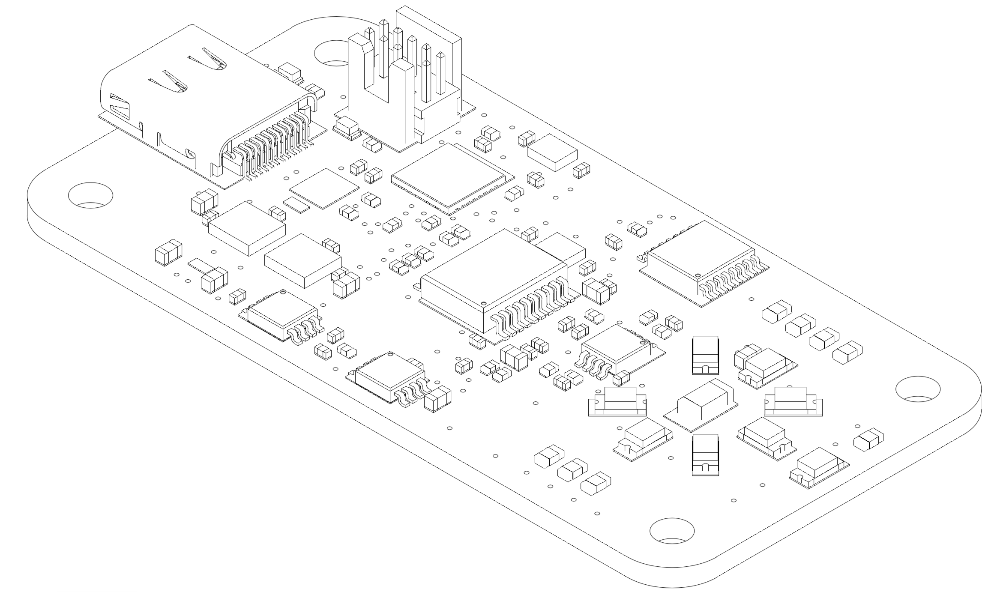

# reremeter hardware

This folder contains all of the source files for making your own reremeter PCB hardware: a Autodesk Eagle project file for the PCB in spectrometer/, rendered gerber files from the Eagle project in manufacturing/, and exported schematics in this [file](hardware/Spectrometer_Schematic.pdf).

The PCB design includes mainly SMT components as the handheld form factor was design criteria. It is possible to assemble individual boards by hand in a few hours (if you bring in decent SMT soldering skills), however for multiple boards it would be advisable to order multiple fully assembled (or at least SMT assembled) PCBs. If you wish to have the PCB manufactured, the files in manufacturing/ should be all you need; additionally, a bill of materials is available [here](hardware/manufacturing/Spectrometer_BOM.txt).
