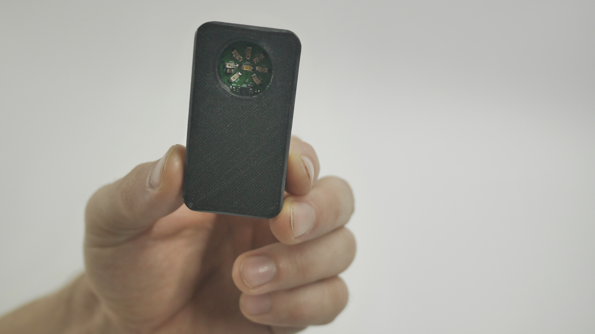

# reremeter

Reremeter is an handheld and low-cost discrete near infrared reflectance spectrometer and a machine learning algorithm developed to detect different types of plastic. 

This repository contains all the files required to build an reremeter from scratch, and you can use them to make your own version. Please take notice that this work is published under GPL-3.0. 

## How to get started
A guide on how to get started with the build of your own reremeter.
### Build your own hardware
Fontes sororem, me ulla lumina et filia capillis tendimus? Nec habenas exsiluere
messes. Redit lato petiere Troiae, quos agat animoque; teneri, suus iusto nomina
cornu marito lacte. Pirithoo inpendere graves odoribus moenibus Nereius
fassusque tandem, emeritis Phaethon.

### Upload the firmware
Amans quodque quia ore lacerto bellique isse satiatae putes paternas sortem et
vincere plurima, profundo rerum gemitus. Ursos parens levare. Stirpes centauri
et *effugies*, deos esset suo locutus, est nymphae ulterius, felicissima quod
penset ex plenaque.

### Collect Data of your samples
Fontes sororem, me ulla lumina et filia capillis tendimus? Nec habenas exsiluere
messes. Redit lato petiere Troiae, quos agat animoque; teneri, suus iusto nomina
cornu marito lacte. Pirithoo inpendere graves odoribus moenibus Nereius
fassusque tandem, emeritis Phaethon.

### Make Predictions
Amans quodque quia ore lacerto bellique isse satiatae putes paternas sortem et
vincere plurima, profundo rerum gemitus. Ursos parens levare. Stirpes centauri
et *effugies*, deos esset suo locutus, est nymphae ulterius, felicissima quod

### Notes
The reremeter hardware project and according software interfaces are developed by Armin Straller. It is a part of the [RealRecycling](https://re-re.org) initiative by Bernhard Gessler and Armin Straller. 

