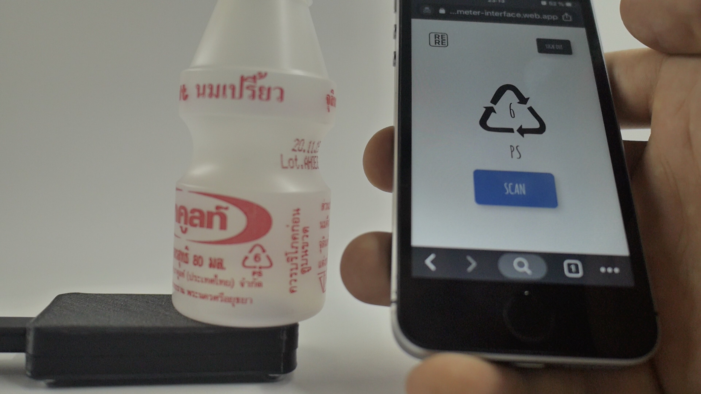

# reremeter web interface

This directory contains the code we used for the scanning interface visible in the above picture. It is a simple HTML, JS and CSS webapp. Using Firebase Authentication and Firebase Realtime Database it is able to run independent of the spectrometers connection. We recommend hosting it with Firebase Hosting for testing. 